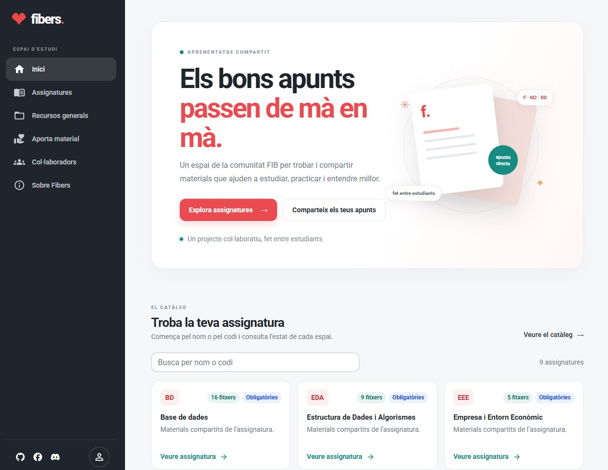

# Fibers

[](https://app.netlify.com/projects/fibers/deploys)

Espai comunitari per trobar i compartir materials d’estudi de la Facultat d’Informàtica de Barcelona (FIB).



## Funcionalitats

- Catàleg d’assignatures amb cerca per nom o codi.
- Pàgina pròpia per a cada assignatura i els seus materials.
- Recursos generals i formulari per aportar materials.
- Pàgines estàtiques amb metadades SEO, dades estructurades i sitemap.

## Tecnologia

Astro, React, Material UI i Supabase. Els formularis de contacte s’integren amb Netlify Forms.

## Desenvolupament local

Requereix Node.js i npm.

1. Instal·la les dependències:

   ```sh
   npm install
   ```

2. Copia `.env.example` a `.env` i configura `PUBLIC_SUPABASE_URL` i `PUBLIC_SUPABASE_PUBLISHABLE_KEY`.
3. Inicia el servidor local:

   ```sh
   npm run dev
   ```

## Compilar i previsualitzar

```sh
npm run build
npm run preview
```

Les pàgines d’assignatura i la llista inicial del catàleg es generen durant la compilació amb les dades de Supabase; els canvis en aquestes dades es reflecteixen després de tornar a compilar i desplegar. La disponibilitat dels materials recuperats es mostra com a pendent de revisió.

## Desplegament

El domini canònic es configura a `astro.config.mjs`. Astro genera el sitemap durant la compilació i `public/robots.txt` n’indica l’adreça. Perquè el formulari de contacte funcioni a Netlify, activa **Form detection** a la configuració del lloc i torna’l a desplegar. El formulari d’aportacions obre el programa de correu; els fitxers s’han d’adjuntar manualment.

Els 54 fitxers recuperats es conserven a `public/files/`. `src/data/materials.json` en manté el catàleg i `src/data/materials.ts` associa cada recurs amb una assignatura o amb la pàgina de recursos generals.
